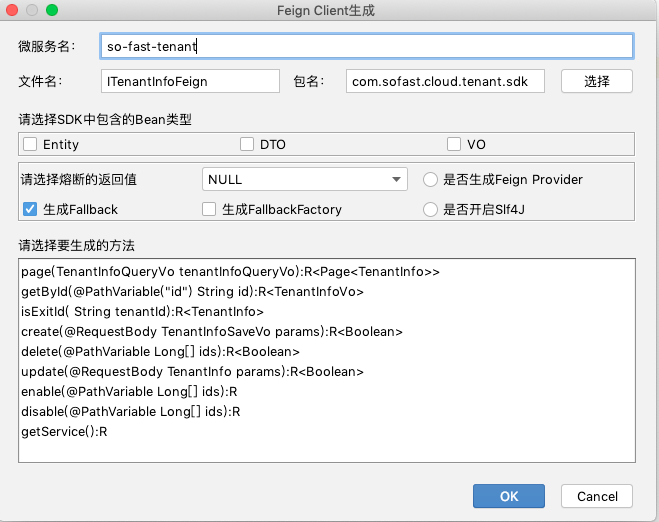

## SoFast框架用 Feign Client 代码生成器
<h4>使用方式</h4>
<b>本地安装</b>：

[Plugins]->[install Plugin from disk...]

使用:

在需要生成Feign客户端的Controller类中，鼠标右键（或快键键Crtl+N）-> [Generate...] -> [SoFast Feign Client]即可打开生成器配置窗口

可根据配置项，选择生成Feign Client SDK。
 

<b>源码开发注意事项</b>：
下载新版Source；
打开IDEA，点击[Module]->[Dependencies]
将lib下的依赖jar包添加到Dependencies中
点击运行

PS：

因为该插件是基于SoFast框架写的，因此在插件中有一些规范必须遵循才能正确的生成代码。
 - 微服务前缀："so-fast-"
 - dto、vo等javabean必须有对应后缀才可以识别，否则统一算作entity
 - package tree规范强制如下：
 
        x.x.x.sdk
                |--constants
                |--domain
                        |--vo
                        |--dto
                |--entity
                |--factory
                |--fallback
                |--feign

SoFast框架是基于SpringBoot+SpringCloud&Alibaba的一套企业级微服务快速开发框架

框架详细文档：http://doc.yangyanqing.cn:4000/book_so-fast-cloud/

